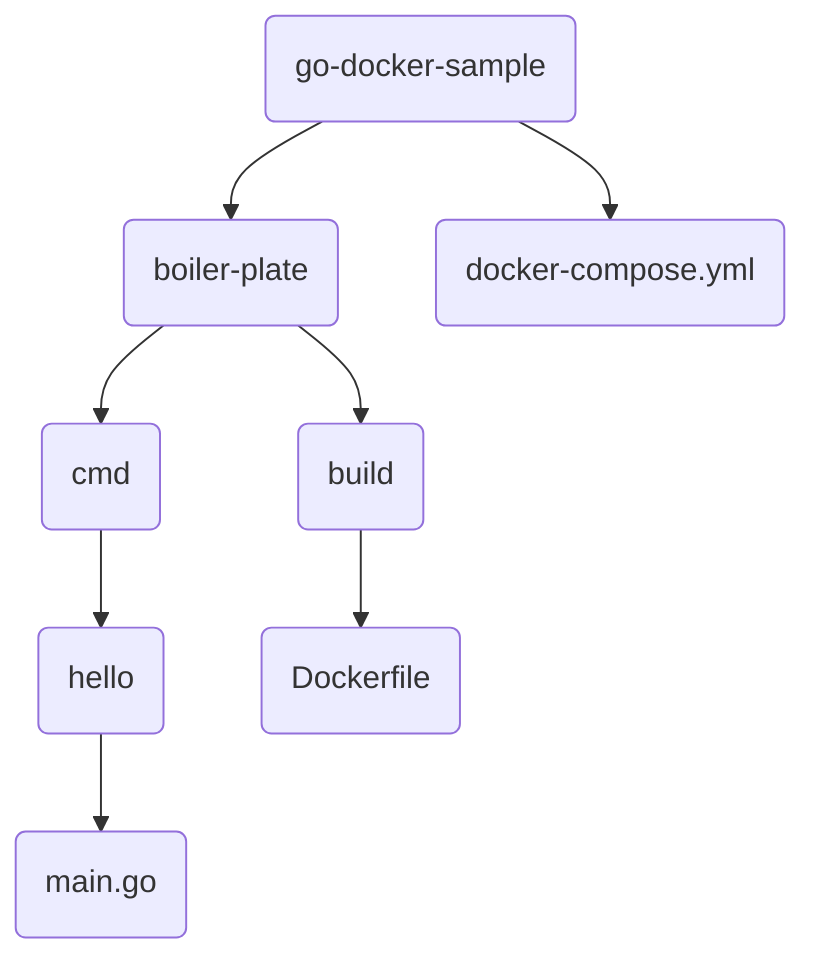

# README

## 概要
このリポジトリには、Dockerを用いたGoのサンプルアプリケーションが含まれています。
本アプリケーションは、boiler-plateというサービス名で起動されます。

## 動作環境
- Docker
- Docker Compose

## インストール方法
1. 本リポジトリをクローンする
2. コンソール上で、以下のコマンドを実行してコンテナを起動
```
docker-compose up -d
```
3. 同じく、以下のコマンドを実行してコンテナに入る
```
docker exec -it boiler-plate /bin/sh
```
4. 以下のコマンドで`main.go`を実行
```
go run cmd/hello/main.go
```

## 構成
以下が、本リポジトリのディレクトリ構成になります。



- boiler-plate/cmd/hello/main.go: Goのサンプルアプリケーションのソースコードが含まれます。
- boiler-plate/build/Dockerfile: Dockerfileが含まれます。
- boiler-plate/docker-compose.yml: Docker Composeファイルが含まれます。
